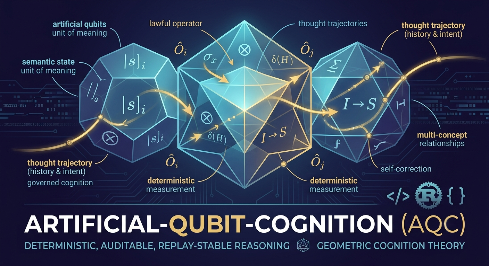

# Artificial-Qubit-Cognition

<p align="center">
	
</p>

Artificial-Qubit-Cognition is a standalone mathematical and conceptual framework for deterministic cognition. It explains how minimal geometric states, invariant-preserving operators, auditable trajectories, and closure rules compose into lawful reasoning without probability, collapse, or floating-point drift.

## Philosophical Preface

AQC uses the word qubit in an ontological and geometric sense, not a physical one. In this framework, quantum means minimal discrete determinable state, and qubit means a minimal geometric state-space unit for computation over meaning.

The central claim is simple: intelligence can be built from the smallest stable units of meaning and the lawful operators that transform them.

## AQC Definition

Artificial Qubit:

> A minimal, deterministic, geometrically structured cognitive state whose evolution is governed by invariant-preserving operators and whose transitions are completely auditable.

This definition intentionally excludes probability, wave collapse, and measurement paradox.

The architecture is built from:

- State
- Geometry
- Operator
- Trajectory
- Closure

## What AQC Is Not

To prevent category errors, AQC is explicitly not:

- quantum mechanics
- a physical qubit simulator
- a neural-network architecture
- a probabilistic cognition model
- a runtime pipeline specification

AQC is a deterministic geometric cognition theory: it defines objects, invariants, algebras, and functionals that implementations may realize.

## DGCS Philosophy

Deterministic Geometric Cognition Substrate (DGCS) is not symbolic logic, neural-network inference, probabilistic search, or quantum simulation. It is a different computational identity:

> deterministic geometric cognition.

In DGCS, cognition is modeled as lawful motion through discrete geometric state spaces, not as token rewriting, stochastic sampling, or gradient descent. Meaning is carried by governed states, transformed by invariant-preserving operators, evaluated by deterministic functionals, and certified by canonical signatures.

This gives DGCS four core commitments:

- **Determinism**: identical inputs produce identical outputs.
- **Geometric semantics**: concepts and relations are represented as structured geometry in $\mathbb{Z}^n$.
- **Governance**: operators, bindings, and trajectories are constrained by explicit invariants.
- **Auditability**: each transition is replay-stable and signature-verifiable.

DGCS should therefore be read as a substrate for computable, verifiable cognition: a system where interpretation is produced by lawful structure rather than probability.

## Primitive Cognitive Distinctions

Cognition begins with distinctions. Before concepts, before relations, and before inference, a cognitive system must be able to differentiate. Artificial-Qubit-Cognition treats these irreducible differences as primitive cognitive distinctions: the smallest deterministic semantic contrasts that can be encoded as governed geometric states and transformed by invariant-preserving operators.

A primitive cognitive distinction is not a fact, proposition, or belief. It is a minimal semantic polarity: a stable, replay-deterministic difference that can participate in geometric thought.

Examples of primitive distinctions include:

- Self / NotSelf - boundary of agency
- Known / Unknown - boundary of epistemic stability
- Safe / Unsafe - boundary of threat assessment
- Equal / Different - boundary of comparison
- Possible / Impossible - boundary of closure

Each distinction corresponds to:

- a canonical geometric state in $U \subseteq \mathbb{Z}^3$
- a governed operator family that transforms it
- a signature that certifies its identity
- a closure constraint ensuring invariant-preserving evolution

These distinctions form the semantic alphabet of AQC. Higher-order cognition, including binding, relational geometry, hierarchical composition, and parallel trajectory families, emerges from lawful transformations of these primitives.

Under this interpretation, an artificial qubit can be read as:

> the smallest deterministic cognitive distinction capable of participating in governed geometric reasoning.

This reframes AQC not as an alternative quantum model or symbolic logic system, but as a systematic attempt to identify the minimal semantic units of cognition and the lawful operators required to make them think.

## Reader's Guide

This document is organized from ontology to algebra to cognitive functionals.

Readers interested in the formal substrate should begin with Sections 1, 2, 3, and 11. Readers focused on cognitive functionals should then read Sections 6-10. The calculator sections are illustrative appendices for discrete arithmetic intuition, not the definition of AQC.

## Illustrative Qubit Arithmetic Demo (Not an AQC Implementation)

This repository includes a minimal Rust calculator that illustrates deterministic fixed-point add/subtract operations on a single qubit-style register using scaling (`1_000_000 = 1.0`).

This demo is not the AQC theory, not a cognition engine, and not a qubit simulator in the physical sense. It is a compact illustration of integer-safe geometric state updates.

Run it locally:

```bash
cargo run
```

Expected core output includes the deterministic verification:

```text
Initial Register Value: 0.0
After Adding 0.1:        0.1
Final Result (0.1 + 0.2): 0.3
```

Run tests:

```bash
cargo test
```

## Illustrative Double-Qubit Arithmetic Demo (Not an AQC Implementation)

The repository also includes a more structured two-qubit arithmetic illustration that keeps a four-state register in fixed-point form.

As above, this is a pedagogical artifact for deterministic geometric arithmetic, not a full implementation of AQC ontology, algebra, and cognitive functionals.

Run it with:

```bash
cargo run --bin double_qubit_calculator
```

The binary prints the register before and after the deterministic superposition and controlled rotation steps.

## Deterministic Semantic Comparator Demo

This demo is the smallest AQC-native reasoning example in the repository.

### What it is

The comparator is a deterministic semantic relation engine over discrete geometric states. Given two semantic states and two governed operator sequences, it computes:

- each candidate trajectory
- each canonical trajectory signature
- a semantic relation label (`Reinforcement`, `Alignment`, `Contrast`, or `Conflict`)
- a deterministic relation signature derived from both trajectories and the resulting label

Unlike embedding similarity or probabilistic scoring, this demo uses only integer geometry, governed operators, and fixed semantic measurement rules.

### How it functions

For each candidate pair, the comparator executes the following functional chain:

- state construction in integer geometry
- governed operator application
- trajectory signature generation
- semantic measurement to a stable label

In code terms, the flow is:

1. Build `SemanticState` values in `\mathbb{Z}^3`
2. Apply `GovernedOperator` sequences to produce `SemanticTrajectory`
3. Measure relation by deterministic geometry (`dot`-style relation test)
4. Emit `ComparisonResult` with a canonical relation signature

### How to run it

Run it with:

```bash
cargo run --bin semantic_comparator
```

The demo compares `DOG` and `WOLF` twice:

- baseline relation with no operator intervention
- transformed relation after applying `Contrast` to one candidate

Expected pattern:

- baseline label: `Reinforcement`
- post-operator label: `Contrast`

Typical output pattern:

```text
Deterministic Semantic Comparator
SemanticRelation(DOG, WOLF) baseline = Reinforcement
Baseline signature: relation:Reinforcement|...
SemanticRelation(DOG, WOLF) after Contrast = Contrast
Contrast signature: relation:Contrast|...
```

Run the full test suite (including comparator tests) with:

```bash
cargo test
```

The important point is that both the semantic label and the signature transition are deterministic and replay-stable.

## Scaling AQs: What Becomes Possible

There is a significant structural difference between single-AQ, double-AQ, and multi-AQ cognition.

| AQ Count | New Structural Power | Cognitive Phenomena Enabled |
| --- | --- | --- |
| 1 AQ | Isolated state + governed operators | Single-concept evolution and projection |
| 2 AQs | Composite bindings and pairwise coherence | Relational reasoning, contrast, alignment tracking |
| 3-4 AQs | Triadic and small-group composites | Context-sensitive judgment over multi-factor scenarios |
| 5+ AQs | Rich trajectory families and hierarchical composition | Multi-candidate arbitration, stable long-horizon context |

Key idea: scaling AQs does not just add memory, it adds governed relational geometry. This enables deterministic cognition over interacting concepts rather than isolated state updates.

## Governed Relational Geometry

Multi-AQ systems form governed relational geometries: structured networks where states are nodes, bindings are invariant-constrained edges, and operator histories encode lawful transformations of meaning.

At this level, AQC can be read as a graph-theoretic cognition substrate:

- states define local geometric identity
- bindings define relational structure
- operators transform local and relational geometry
- trajectories trace paths through the meaning graph
- signatures certify every transition in replay-stable form

This is the conceptual shift from isolated arithmetic state updates to deterministic relational cognition.

## Hierarchical Binding and Super-AQs

Bindings are compositional. A governed composite can itself be treated as a higher-order atomic unit for subsequent operator action.

Formally, if a binding map produces composite objects

$$
B : \mathcal{S} \times \mathcal{S} \to \mathcal{B},
$$

then governed compositions over $\mathcal{B}$ can be lifted into a higher-order state space $\mathcal{S}^{(1)}$ (informally, super-AQs), enabling nested cognition layers.

Practical consequences:

- local concepts aggregate into mid-level composites
- composites can be reasoned over as single cognitive units
- abstraction depth increases without abandoning determinism
- long-horizon reasoning remains auditable via layered signatures

## Parallel Trajectory Families

AQC natively supports parallel trajectory families: multiple candidate trajectories evolving under the same governed algebra and invariant contract.

Given a candidate set $\mathcal{C}$, each candidate induces a trajectory $T_c$ and a functional evaluation chain. These trajectories need not be interpreted as a single sequential path; they are a family of concurrent reasoning hypotheses over a shared semantic substrate.

This enables:

- deterministic multi-candidate planning
- structured comparison of competing interpretations
- scenario and debate-style reasoning without stochastic sampling
- stable arbitration and correction over full candidate families

The key property is that parallelism increases expressiveness while preserving closure, determinism, and auditability.

## 3-AQ Deterministic Relational Reasoner Demo

This demo is an easy-to-construct but significantly more expressive example than the calculators. It demonstrates how three AQs can represent:

- agent orientation
- action candidate geometry
- context/value constraints

and then evaluate multiple plans using deterministic operator evolution and governed arbitration.

### What it demonstrates

- triadic relational reasoning (Agent-Action-Context)
- multi-candidate evaluation
- deterministic scoring and winner selection
- correction-aware, signature-tracked decision output

### How to run it

```bash
cargo run --bin three_aq_reasoner
```

Expected output pattern includes:

- per-plan labels and scores (`Aligned`, `Risky`, `Rejected`)
- plan signatures with operator and correction trace
- deterministic winner and tournament signature

Run all tests:

```bash
cargo test
```

## Notation & Conventions

## Reusable DGCS Substrate

Three core modules that every DGCS reasoner shares now live in `src/geom/` as reusable infrastructure:

| Module | Exported Types | Role |
| --- | --- | --- |
| `geom::topology_gate` | `TopologyStatus` | Shared outcome type for all topological invariant gates |
| `geom::resonance_field` | `ResonanceField`, `ResonanceScore` | Resonance field state in $\mathbb{Z}^3$ and decomposed scoring struct |
| `geom::correction_buffer` | `CorrectionBuffer` | Pre-stabilised fallback archive for drift-triggered instant recovery |

Domain-specific reasoning modules supply their own `check_topology()` and `evaluate_resonance()` functions in a local `evaluation.rs`. The substrate types and the scoring formula `score = stability + symmetry - drift + coherence` are shared unchanged across all domains.

## Bridge-Builder Reasoner: Canonical Super-AQ Reference

The Bridge-Builder Reasoner (BBR) is the reference implementation of multi-scale AQC cognition. It demonstrates all six DGCS layers — primitive AQs, super-AQs, meta-AQs, three operator levels, topological invariant gate, and resonance-modulated arbitration — and is the model every future DGCS reasoner should be compared against.

### Design Notes

**Why `[drift, symmetry, stability]` axes?**

Each primitive AQ encodes three semantic dimensions as integer coordinates in $\mathbb{Z}^3$:

- `coords[0]` — drift axis: contribution to structural deviation from baseline
- `coords[1]` — symmetry axis: left-right balance contribution (measured across span meta-AQs only)
- `coords[2]` — stability axis: structural load capacity

This encoding produces the three key resonance metrics as pure integer sums — no thresholds, no heuristics, no floating point. The scoring formula `score = stability + symmetry - drift + coherence` is a single deterministic linear functional over the primitive coordinate space.

**How topology gating works**

Before any trajectory is accepted, the Topological Invariant Validator checks:

- Whether any span section (LeftSpan or RightSpan) contains a `Disconnected` primitive — producing an **unsupported span** violation
- Whether any single structural component contains two or more `Unstable` primitives — producing an **unstable joint** violation

A rejected design triggers the correction buffer, which holds pre-validated fallback trajectories for instant recovery without recomputation.

**How `DistributeLoad` adds coherence**

The `DistributeLoad` meta-operator contributes a deterministic `+6` structural coherence bonus — the governance-specified consequence of applying a load redistribution transformation across the bridge's meta-AQ sections. Coherence bonuses allow the scoring functional to reward globally sound structural choices even when local stability is only moderate.

### How to run it

```bash
cargo run --bin bridge_builder
```

Expected output:

```text
Bridge-Builder Reasoner Demo
--------------------------------
Evaluating Design A...   Stability: 32  Symmetry: 18  Drift: 4   Topology: Valid  Score: 46
Evaluating Design B...   Stability: 41  Symmetry: 22  Drift: 1   Topology: Valid  Score: 62
Evaluating Design C...   Stability: 28  Symmetry: 10  Drift: 7   Topology: Invalid (unsupported span)  Score: Rejected
Evaluating Design D...   Stability: 35  Symmetry: 12  Drift: 3   Topology: Valid  Score: 50
Winner: Design B
Tournament Signature: bridge:metaAQ|winner:B|A:46|B:62|C:invalid|D:50
```

See [DGCS_SPEC.md](DGCS_SPEC.md) for the full substrate specification.

## Power Grid Reasoner: Same Substrate, Different Ontology

The Power Grid Reasoner applies the identical DGCS substrate to multi-zone electrical grid routing. It uses the same `geom::topology_gate`, `geom::resonance_field`, and `geom::correction_buffer` — but a completely different ontology:

| Scale | Types |
| --- | --- |
| Primitive AQs | Energized, DeEnergized, Overloaded, Nominal, Connected, Isolated, Protected, Unprotected, Standby, Idle |
| Super-AQs | Circuit, Breaker, Load, Line |
| Meta-AQs | NorthZone (active), CentralSubstation, SouthZone (active) |

The topology gate rejects any plan with an `Isolated` circuit node in an active zone or an overload cascade. `ShedLoad` contributes the `+6` coherence bonus. This demo proves the substrate is domain-independent:

> Change the ontology. Keep the substrate.

### How to run it

```bash
cargo run --bin power_grid_reasoner
```

Expected output:

```text
Power Grid Reasoner Demo
--------------------------------
Evaluating Routing Plan A...  Stability: 30  Symmetry: 16  Drift: 5  Topology: Valid  Score: 41
Evaluating Routing Plan B...  Stability: 39  Symmetry: 20  Drift: 2  Topology: Valid  Score: 57
Evaluating Routing Plan C...  Stability: 25  Symmetry: 12  Drift: 8  Topology: Invalid (isolated circuit node)  Score: Rejected
Evaluating Routing Plan D...  Stability: 33  Symmetry: 14  Drift: 3  Topology: Valid  Score: 50
Winner: Routing Plan B
Tournament Signature: grid:metaAQ|winner:B|A:41|B:57|C:invalid|D:50
```

Run all tests:

```bash
cargo test
```


The document uses a small, stable notation set so that the same objects can be tracked across the full stack:

- $\vec{s} \in \mathbb{Z}^3$ denotes a discrete geometric state
- $U$ denotes the governed unit set of valid discrete states
- $O$ denotes an operator acting on a state or binding
- $B(\vec{s}_1, \vec{s}_2)$ denotes a binding between states
- $T$ denotes a thought trajectory and $T'$ its resonance-adjusted form
- $F(T)$ denotes the feature vector extracted from a trajectory
- $R$ denotes a resonance field or resonance scoring map
- signatures are canonical identifiers derived from structure and history, never heuristic labels

Unless stated otherwise, all computations are discrete, integer-safe, and replay-stable. Terms such as deterministic, governed, canonical, and auditable are used in their strict architectural sense rather than as informal adjectives.

## Document Structure (Standalone AQC)

| Layer | Role In AQC | Outcome |
| --- | --- | --- |
| Ontology | State, geometry, operator, binding, trajectory, closure | Precise objects and invariants |
| Algebra | Operator families, composition rules, commutation structure | Deterministic transform language |
| Functional Layers | Measurement, resonance, arbitration, correction | Deterministic judgment functionals |
| Artifact Layer | Canonical signatures and auditable records | Replay-stable cognitive evidence |
| Implementation Mapping | Optional realization in engines such as GORT (Geometric Operator-Regulated Thought) | Practical execution without changing the theory |

## Mathematical Foundations

The formal substrate of AQC can be summarized as a compact object-and-map system:

- Discrete state space: $\mathcal{S} \subseteq \mathbb{Z}^n$
- Governed unit set: $U \subseteq \mathcal{S}$
- Operator family: $\mathcal{O} \subseteq \{O : \mathcal{S} \to \mathcal{S}\}$ with governed commutation and closure constraints
- Binding construction: $B : \mathcal{S} \times \mathcal{S} \to \mathcal{B}$
- Trajectory space: $\mathcal{T}$ generated by ordered operator application over states and bindings
- Canonical signature map: $\Sigma : (\mathcal{S} \cup \mathcal{B} \cup \mathcal{T}) \to \mathcal{K}$

Core requirements:

- closure: governed transforms remain within domain constraints
- determinism: identical inputs yield identical outputs
- auditability: signatures provide replay-stable identity over structure and history

## 1. Introduction: Ontology Before Implementation

Most cognitive systems describe behavior before defining ontology. AQC does the opposite. It begins by specifying the smallest lawful units of meaning and the lawful transforms that can act on them. Only after those objects are fixed does the framework define inference, arbitration, and correction.

Artificial-Qubit-Cognition begins from the premise that cognition is a deterministic geometric process over governed discrete states. The framework is not a claim about physical quantum mechanics. It is a claim about computable cognition under strict invariants.

If cognition is to be deterministic, auditable, and replay-stable, then its primitives must be discrete, governed, and algebraically constrained.

This repository therefore defines:

- what a valid cognitive state is
- what an operator is allowed to do
- how trajectories are formed and classified
- how closure and invariants are enforced
- how auditability is preserved across every transition

In this architecture, operators are primary. States provide identity; operators provide motion; trajectories provide observable reasoning; closure provides stability; signatures provide evidence.

The ordering is deliberate:

- Ontology first
- Algebra second
- Cognitive functionals third
- Implementation mapping last

This ordering keeps AQC independent from any single runtime. Engines can implement AQC, but they do not define it.

## 2. Artificial Qubits: Discrete Geometric States

Artificial qubits matter in this repository because they provide a stable substrate for operator action. They are necessary, but they are not the final explanatory center of the architecture.

Artificial-Qubit-Cognition begins with a deliberate departure from the continuous Bloch sphere. Instead of representing cognitive primitives as floating-point vectors on $S^2 \subset \mathbb{R}^3$, we adopt a discrete geometric state space embedded in $\mathbb{Z}^3$. These states behave structurally like qubits, supporting axes, rotations, and non-commuting operators, while avoiding the nondeterminism, rounding drift, and replay instability inherent to continuous arithmetic.

A discrete geometric state is a vector

$$
\vec{s} = (x, y, z) \in \mathbb{Z}^3
$$

constrained to a finite, governed unit set $U$. Membership in $U$ replaces the continuous norm constraint $\|\vec{s}\| = 1$. This gives each state a canonical identity and ensures that all transformations remain integer-safe and byte-stable. The result is a qubit-like primitive whose evolution can be replayed exactly, bit-for-bit, across machines, compilers, and time.

This discretization is not a numerical approximation. It is a design choice that enables deterministic cognition. By constraining states to a finite geometric alphabet, we obtain:

- canonical state signatures for auditability
- drift-free operator application
- deterministic binding and trajectory formation
- stable semantic measurement surfaces

In this framework, an artificial qubit is not a quantum object but a governed geometric atom of thought. It is the smallest unit in a cognition system built entirely from discrete, reproducible transformations. The remainder of the stack, operators, bindings, trajectories, semantics, inference, arbitration, and correction, emerges from the algebra defined over these states.

## 3. Artificial Operators: Non-Commuting Governance

If discrete geometric states are the atoms of cognition, then operators are the laws of motion that govern how those states evolve. In Artificial-Qubit-Cognition, operators are integer-safe linear maps over the discrete state space $\mathbb{Z}^3$ with a governed commutation structure.

1. They operate entirely in integer arithmetic, ensuring byte-stable replay.
2. They preserve governed state membership in $U$ under normalization.
3. Their non-commutation structure is explicit and invariant-constrained.

This makes the artificial operator, not the qubit analogy alone, the active cognitive primitive. States persist, but thought is expressed as a governed trajectory through state space under deterministic operator action.

Operator-first cognition can be sketched informally as:

```text
State: Dog
Operator: Abstraction
Dog -> Mammal -> Animal

State: Dog
Operator: Contrast
Dog <-> Wolf
```

What matters is not that the state exists. What matters is that a governed operator moves the state through a stable semantic geometry in a way that remains auditable and replay-stable.

An operator $O$ is represented as a small integer matrix

$$
O \in \mathbb{Z}^{3 \times 3},
$$

chosen such that $O\vec{s}$ always maps back into the discrete unit set $U$ after normalization. This ensures that every transformation preserves the canonical identity of states and maintains the invariants required for deterministic cognition.

The core insight is that non-commuting operators create structure. When two operators $A$ and $B$ satisfy

$$
[A, B] = AB - BA \neq 0,
$$

the order of application matters. This asymmetry is what allows trajectories to encode history, context, and semantic differentiation. In a deterministic cognition system, non-commutation is not a nuisance. It is the mechanism by which meaning emerges.

To support this, the operator algebra includes governed operator families such as:

- axis inversion maps for sign and orientation changes
- basis change maps for controlled coordinate transformations
- mixed non-commuting families that introduce structured asymmetry while remaining in integer space

Each operator family carries a canonical signature, and the full commutation table is treated as a governed artifact. These signatures allow the system to detect drift, validate invariants, and ensure that operator application remains stable across compilers, architectures, and time.

This algebra forms the backbone of the cognition stack. Operators define how states evolve, how bindings interact, how trajectories form, and how semantic surfaces are eventually projected. Without non-commuting governance, the system would collapse into a reversible but meaningless dynamical loop. With it, Artificial-Qubit-Cognition gains the expressive power needed for structured, deterministic thought.

## 4. Semantic Binding: Multi-Qubit Coherence

Discrete geometric states provide the atoms of cognition, and operators provide their laws of motion, but cognition does not emerge from isolated primitives. Thought requires relationships, structured connections between states that persist across operator application and influence the evolution of trajectories. Semantic binding is the mechanism that introduces this relational structure.

In Artificial-Qubit-Cognition, a binding is a deterministic composition of two, or more, artificial qubits into a governed multi-state object. Unlike tensor products in quantum mechanics, which expand the state space continuously, bindings in this architecture remain strictly within integer arithmetic and preserve canonical identity through normalization and signature tracking. The goal is not to simulate entanglement, but to capture its structural role: creating dependencies between states that operators must respect.

A binding $B(\vec{s}_1, \vec{s}_2)$ produces a composite state whose behavior depends on both inputs and their history. This composite carries a binding signature, a canonical identifier that encodes:

- the discrete geometry of the constituent states
- the operator history that produced the binding
- the classification of the relationship

Bindings fall into several deterministic categories:

- Separable - states evolve independently; no shared operator history
- Correlated - states share aligned axes or operator effects
- AntiCorrelated - states exhibit structured opposition, for example mirrored axes
- EntanglingOpApplied - a non-commuting operator has created a history-dependent relationship

These categories are not probabilistic labels. They are governed invariants derived from the algebra of the operator sequence and the geometry of the states. A binding's classification determines how future operators propagate through the composite, how trajectories diverge or converge, and how semantic measurement interprets the resulting evolution.

By introducing binding, the cognition stack gains its first form of coherence: the ability to treat multiple states as a single structured unit with internal dependencies. This is the foundation for multi-concept reasoning, relational inference, and the higher-order cognitive behaviors that emerge in later layers. Binding transforms artificial qubits from isolated geometric atoms into the building blocks of structured, deterministic thought.

## 5. Thought Trajectories: Deterministic Operator Sequences

Once states and bindings are defined, cognition emerges not from isolated transformations but from ordered sequences of operator applications. A thought trajectory is the deterministic path a bound state takes as operators act upon it, each step producing a new state, a new binding configuration, and a new canonical signature. Trajectories are the first structure in the cognition stack that encode history, direction, and intent.

Formally, a trajectory is an ordered tuple

$$
T = (\vec{s}_0, O_1, \vec{s}_1, O_2, \vec{s}_2, \ldots, O_n, \vec{s}_n),
$$

where each $\vec{s}_i$ is a discrete geometric state, or binding, and each $O_i$ is a governed operator from the algebra defined in Section 3. Because operators are non-commuting, the sequence is not merely a record of transformations. It is the semantic backbone of the reasoning process. The order of operations determines the structure of the resulting path, the classification of the trajectory, and the interpretation applied during semantic measurement.

Trajectories fall into several deterministic categories:

- Convergent - successive operator applications reduce geometric divergence, stabilizing toward a canonical axis or binding
- Divergent - operator effects amplify differences, producing expanding geometric separation
- Entangling - operator sequences create or reinforce history-dependent relationships between states
- Degenerate - repeated application of commuting operators yields no meaningful evolution

Each step in a trajectory carries a step signature, and the full trajectory carries a trajectory signature, a canonical, replay-stable identifier derived from the sequence of operators, states, and binding classifications. These signatures form a merkle-like chain that guarantees auditability: any deviation in operator order, binding structure, or normalization produces a different signature, making drift immediately detectable.

Concrete data-schema fields for trajectory records are implementation notes and are intentionally separated into Appendix B. At the theory layer, the requirement is stable: a thought trajectory must remain a replay-stable record of how cognition moved through governed state geometry.

Thought trajectories are the first point in the cognition stack where temporal structure appears. They encode not only what the system is thinking, but how it arrived there. This temporal geometry becomes the substrate for semantic measurement, resonance inference, arbitration, and self-correction. In this way, trajectories transform artificial qubits from static geometric primitives into deterministic, interpretable paths of thought.

## 6. Semantic Measurement: Projection to Interpretation

$$
M : \mathcal{T} \to \mathcal{L}, \quad M(T) = \ell
$$

Thought trajectories encode the evolution of discrete geometric states under governed operator sequences, but cognition requires more than motion through state space. It requires interpretation, a way to project the structure of a trajectory onto a stable semantic surface. Semantic measurement is the deterministic mechanism that performs this projection, converting geometric and operator-level behavior into meaningful cognitive labels.

In Artificial-Qubit-Cognition, semantic measurement is not probabilistic collapse, nor is it an information-destroying projection. Instead, it is a governed classification function that maps a trajectory's canonical features to a semantic label. A measurement surface is defined as a deterministic rule set that evaluates:

- axis alignment, for example Z-dominant, X-flipped, or mixed-axis
- binding structure, including separable, correlated, anticorrelated, or entangling
- trajectory kind, including convergent, divergent, entangling, or degenerate
- operator history, including commutation patterns and signature transitions
- stability indicators, including drift, oscillation, and invariant violations

These features form a structured signature vector that the measurement function evaluates against a finite semantic lattice. The lattice contains labels such as:

- Alignment - trajectory stabilizes toward a canonical axis or binding
- Reinforcement - operator sequence strengthens an existing semantic relation
- Conflict - operator effects oppose or destabilize prior structure
- EntanglingInfluence - history-dependent relationships dominate evolution
- Contrast - trajectory amplifies differences between bound states

Each label corresponds to a deterministic region of the measurement surface. No randomness, heuristics, or floating-point thresholds are involved. The mapping is entirely rule-driven and replay-stable.

Semantic measurement is the first point in the cognition stack where meaning emerges. It transforms the raw geometry of trajectories into interpretable cognitive signals that can be used by higher-order processes. The measurement layer does not decide which trajectory is best, that is the role of arbitration, but it provides the semantic substrate on which inference, comparison, and correction operate.

By grounding interpretation in discrete geometry and canonical signatures, semantic measurement ensures that cognition remains deterministic, auditable, and invariant-preserving. It is the bridge between the algebraic mechanics of artificial qubits and the structured reasoning behaviors that define the rest of the cognition stack.

## 7. Resonance Inference: Field-Modulated Judgment

$$
R : F(\mathcal{T}) \to \mathbb{Z}, \quad T' = \mathrm{ResonanceAdjust}(T)
$$

Semantic measurement classifies what a trajectory is, but cognition also requires a mechanism for determining what a trajectory means in context. Resonance inference provides this layer. It introduces a deterministic influence field that modulates how trajectories are interpreted, weighted, and ultimately judged. Unlike probabilistic inference or energy-minimization schemes, resonance in Artificial-Qubit-Cognition is a purely governed, integer-safe reweighting of canonical features.

A resonance field is a structured mapping

$$
R : F(T) \to \mathbb{Z}
$$

where $F(T)$ is the feature vector extracted from a trajectory: axis transitions, binding classifications, operator signatures, stability indicators, and semantic labels. The resonance score is computed as a weighted sum over these features, with weights chosen to reflect the system's cognitive priorities, for example stability, coherence, and reinforcement. Because all weights and features are integers, resonance remains byte-stable and replay-deterministic.

Resonance does not alter the trajectory itself. It alters the interpretive gravity around it. A trajectory with strong alignment and low drift may receive a high resonance score, while one with conflicting operator signatures or unstable bindings may be down-weighted. This modulation creates a contextual preference structure that higher-order processes, particularly arbitration, use to select among competing cognitive paths.

The resonance-modulated interpretation of a trajectory is itself a deterministic object:

$$
T' = \mathrm{ResonanceAdjust}(T),
$$

where $T'$ carries the same geometric evolution as $T$ but with an updated semantic weighting. This produces an inference trajectory, a conceptual path that reflects both the raw operator-driven evolution and the system's governed interpretive biases.

Resonance inference is the first point in the cognition stack where the system exhibits judgment, not as a heuristic or probabilistic guess, but as a structured, rule-driven modulation of meaning. It allows the system to emphasize coherence, penalize drift, reward stable bindings, and highlight entangling influences, all without sacrificing determinism or auditability.

By introducing resonance, Artificial-Qubit-Cognition gains the ability to perform context-sensitive reasoning while remaining fully governed. This prepares the ground for arbitration, where multiple inference trajectories compete under the influence of resonance-derived scores to produce a single, stable cognitive decision.

## 8. Arbitration: Deterministic Decision Functional

$$
A : \mathcal{T} \to \mathbb{Z}, \quad T_{\mathrm{winner}} = \arg\max_{T_i \in \mathcal{C}} A(T_i)
$$

Resonance inference provides a contextual weighting of trajectories, but cognition requires more than weighted interpretation. It requires choice. When multiple inference trajectories are available, the system must select a single winner in a way that is deterministic, auditable, and invariant-preserving. Arbitration is the governed decision functional that performs this selection.

In Artificial-Qubit-Cognition, arbitration is not a search algorithm, not a probabilistic sampler, and not an optimization loop. It is a deterministic decision functional over a finite set of candidate trajectories, each carrying:

- a geometric evolution
- a semantic measurement
- a resonance-modulated inference score
- a stability and drift profile
- a canonical trajectory signature

Arbitration evaluates these candidates using a family of meta-operators, higher-order governance rules that determine how the system prioritizes stability, coherence, semantic alignment, or conflict resolution. These meta-operators include:

- StabilityFirst - prefer trajectories with minimal drift and strong invariant preservation
- InferenceFirst - prioritize resonance-weighted semantic strength
- SemanticCoherenceFirst - reward consistent binding and operator history
- ConflictResolver - down-weight trajectories exhibiting contradictory semantic surfaces

Each meta-operator defines a deterministic scoring function

$$
A(T_i) = \alpha R(T_i) + \beta S(M(T_i)) + \gamma C(T_i),
$$

where $R(T_i)$ is the resonance score, $S(M(T_i))$ is the semantic label score, and $C(T_i)$ is a correction-stability indicator. The coefficients $\alpha, \beta, \gamma \in \mathbb{Z}$ are fixed by the governance contract and never learned or adapted at runtime.

Arbitration then selects the winner via a simple, replay-stable rule:

$$
T_{\mathrm{winner}} = \arg\max_i A(T_i).
$$

Because all components, features, weights, signatures, and scoring functions, are discrete and governed, arbitration is fully deterministic. Any deviation in operator order, binding structure, or semantic classification produces a different trajectory signature and therefore a different arbitration result, making drift or corruption immediately detectable.

Arbitration is the first layer where the system produces a single cognitive decision from multiple competing interpretations. It is the mechanism that transforms structured reasoning into structured judgment, ensuring that the cognition stack remains coherent, stable, and aligned with its invariant contract.

This prepares the ground for self-correction, where the chosen trajectory is subjected to drift detection and stabilization to ensure that the final cognitive output is not only correct but robust.

## 9. Self-Correction: Drift Detection & Stabilization

$$
C_{\mathrm{corr}} : \mathcal{T} \to \mathcal{T}, \quad T_{\mathrm{stable}} = C_{\mathrm{corr}}(T_{\mathrm{winner}})
$$

Arbitration selects a single winning trajectory, but a decision is only as reliable as the stability of the reasoning that produced it. Even in a fully discrete, integer-safe cognition system, operator sequences can accumulate structural tension: semantic divergence, binding instability, conflicting operator signatures, or violations of the invariant contract. The self-correction layer introduces the governed mechanism that detects and repairs these forms of drift.

Self-correction begins with drift detection, a deterministic evaluation of the winning trajectory's canonical signatures. The system examines:

- invariant violations - mismatches in state, operator, or binding signatures
- semantic divergence - conflicting measurement surfaces across trajectory segments
- inference instability - resonance scores that oscillate or contradict semantic labels
- binding degradation - transitions from correlated to anticorrelated states without operator justification
- trajectory inconsistency - step-level signatures that break the merkle-like chain

Each of these signals is discrete and replay-stable; no heuristics or thresholds are involved. If any drift is detected, the system constructs a correction plan, a sequence of deterministic repair operators chosen from a governed set:

- RestoreInvariant - re-establish canonical state or operator signatures
- RepairSemanticTrajectory - adjust semantic surfaces to match geometric evolution
- StabilizeInferenceField - reweight resonance fields to eliminate oscillation
- DampDrift - apply stabilizing operators to reduce divergence in state geometry

A correction plan is itself a trajectory, carrying its own canonical signature and subject to the same invariants as any other cognitive path. Once applied, the corrected trajectory replaces the original winner, producing a stabilized cognitive decision that is both semantically coherent and invariant-preserving.

Self-correction is the final safeguard in the cognition stack. It ensures that the system's output is not merely the best candidate among several, but a structurally sound decision whose reasoning chain has been validated, repaired, and stabilized. With this layer, Artificial-Qubit-Cognition becomes a self-maintaining cognitive architecture, capable of sustaining coherent reasoning across long horizons without drift, randomness, or loss of auditability.

## 10. Layer Composition: Deterministic Cognitive Functional

A single trajectory can express a line of reasoning, but cognition rarely operates in isolation. Real reasoning requires candidate comparison under invariant-preserving functionals. In AQC, layer composition is defined mathematically as functional composition over a finite candidate set, not as a runtime loop primitive.

Let $C$ be a finite set of candidates. For each $c \in C$, define:

$$
\vec{s}_c = \mathrm{State}(c), \quad
T_c = \mathrm{Trajectory}(\vec{s}_c), \quad
M_c = \mathrm{Measure}(T_c), \quad
R_c = \mathrm{Resonance}(F(T_c)).
$$

Define governed arbitration score:

$$
A_c = \alpha R_c + \beta S(M_c) + \gamma C_c,
$$

with fixed integer coefficients and invariant-preserving terms. The selected candidate is:

$$
c^{*} = \arg\max_{c \in C} A_c.
$$

Then apply deterministic correction functional:

$$
T^{\ast}_{\mathrm{stable}} = \mathrm{Correct}\left(T_{c^{\ast}}\right).
$$

The result is a composition artifact: a complete, replay-stable record of the cognitive process, including:

- the winning plan
- its semantic label
- arbitration score
- resonance profile
- correction plan, if applied
- stabilization signature
- full trajectory and operator history
- candidate count and per-candidate signatures

This artifact is not a log. It is a governed cognitive object, a deterministic summary of the system's reasoning. Any deviation in operator order, binding structure, semantic classification, or resonance weighting produces a different canonical signature, making the entire process auditable and drift-detectable.

This layer composition should be read as a compositional mathematical object over candidates. It does not define a required runtime order; it defines invariant-preserving relations among state construction, measurement, resonance, arbitration, and correction.

## 11. Determinism & Governance: The Invariant Contract

A cognition system is only as trustworthy as the guarantees that govern its behavior. Artificial-Qubit-Cognition is built on the principle that reasoning must be deterministic, consistent, closed, and auditable at every layer of the stack. These four properties form the invariant contract, a set of structural commitments that ensure the system behaves identically across runs, machines, compilers, and time.

At the foundation of this contract is determinism: every operator application, binding formation, trajectory evolution, semantic measurement, resonance weighting, arbitration decision, and correction plan must produce the same result given the same inputs. Integer-safe arithmetic, discrete geometric states, and canonical signatures guarantee that no floating-point drift, nondeterministic ordering, or probabilistic sampling can influence cognition.

Consistency ensures that all transformations preserve the structural rules of the system. Operators must map states back into the discrete unit set; bindings must maintain valid classifications; trajectories must maintain their merkle-like signature chains; semantic surfaces must classify deterministically; resonance fields must apply fixed integer weights; arbitration must follow governed scoring rules. Consistency is the glue that prevents reasoning from fracturing into incompatible interpretations.

Closure guarantees that every cognitive action stays within the governed algebra. No operator may produce an out-of-domain state; no binding may introduce undefined relationships; no trajectory may evolve into an unclassifiable form. Closure ensures that the system never escapes its own rules, a critical property for long-horizon reasoning and multi-layer cognition.

Finally, auditability provides the mechanism for verifying that the invariant contract has been upheld. Every state, operator, binding, trajectory, semantic label, resonance score, arbitration result, and correction plan carries a canonical signature, a deterministic identifier derived from its structure and history. These signatures form a complete, replay-stable record of the system's reasoning. Any deviation, however small, produces a different signature, making drift immediately detectable.

Together, these invariants transform Artificial-Qubit-Cognition from a theoretical model into a governed cognitive architecture. They ensure that reasoning is not only correct but verifiable, not only structured but stable, not only expressive but safe. The invariant contract is the backbone of the system's reliability.

## Appendix A. Optional Implementation Mapping (GORT)

Artificial-Qubit-Cognition is the primary theory. GORT (Geometric Operator-Regulated Thought) is one implementation of that theory. This appendix is intentionally optional and exists only to show one practical realization.

Where this repository specifies what the cognition system is, GORT specifies how one runtime executes it.

GORT maps the theory through:

- schema-driven state definitions that enforce the discrete unit set and canonical signatures
- operator modules that encode the AQC operator algebra in integer-safe Rust primitives
- binding engines that construct and classify multi-state composites
- trajectory builders that maintain merkle-like signature chains
- semantic measurement modules that evaluate deterministic semantic surfaces
- resonance inference fields that apply governed influence operators
- arbitration logic that executes tournament scoring
- self-correction operators that perform deterministic stabilization

This mapping is exact at the invariant level: every signature rule, operator constraint, and semantic classification described here is enforced at runtime by GORT's schemas, gauntlet tests, and governance gates.

This division of labor ensures that cognition remains both principled and executable. Artificial-Qubit-Cognition provides the mathematical and architectural clarity needed to reason about the system, while GORT provides the deterministic machinery needed to run it. Together, they form a unified cognitive framework: theory and implementation, specification and execution, invariants and enforcement.

## Appendix B. Implementation Notes: Trajectory Record Envelope

This appendix records one implementation-oriented data envelope for trajectory artifacts. It is provided for implementers and is not part of the core ontology.

A minimal `ThoughtTrajectory` record may include fields such as:

- origin
- operators_applied
- bindings_crossed
- closure_status
- audit_history

Implementations may append interpretation-specific fields such as resonance weighting, arbitration score, and correction status, provided canonical signatures and invariant checks remain intact.

## Non-Goals

Artificial-Qubit-Cognition is intentionally specific about what it is not attempting to do. It is not a simulation of physical quantum mechanics, not a probabilistic cognition model, not a floating-point optimization framework, and not a heuristic language-model wrapper dressed in geometric vocabulary.

It is also not a claim that quantum mechanics has been reproduced in software. The more precise framing is: a deterministic geometric cognition framework using artificial qubit-inspired state spaces.

The system does not attempt to preserve the full physical semantics of Hilbert-space quantum theory. It borrows structural concepts, such as state axes, non-commuting operators, and entangling dependencies, only where those concepts can be reinterpreted as deterministic, governed mechanisms inside a discrete algebra.

Likewise, the architecture does not treat randomness as a hidden source of cognition. When context sensitivity, competition, or correction appear in the stack, they do so through fixed rules, integer-safe weighting, and canonical signatures, not through stochastic exploration.

## 12. Governed Cognitive Extensions: Must-Add Features

The core architecture of Artificial-Qubit-Cognition is complete and functioning, as evidenced by the deterministic 4-AQ scenario reasoner demonstration. However, six major feature enhancements are essential to scale the framework toward full deterministic artificial general cognition. These are not open research questions; they are well-defined architectural additions that preserve the invariant contract while dramatically expanding expressiveness and applicability.

### 12.1 Governed Meta-Programming: Operator Discovery

**Architectural Role:** Enable the system to synthesize new operators while maintaining determinism and closure.

**Current Limitation:** AQC operator families are fixed at system initialization. While this ensures reliability, it prevents the system from discovering new reasoning patterns or adapting to novel reasoning domains.

**The Solution: Governed Algebra Generator**

A Governed Algebra Generator is a deterministic meta-operator that proposes and validates new operators without violating the invariant contract. The process works as follows:

1. **Operator Template Generation** - The system generates candidate operators by composing primitive transformation matrices (rotation, shear, reflection) in deterministic sequences.

2. **Commutation Validation** - Each candidate is tested against the existing operator algebra to ensure:
   - Non-commutation structures remain well-defined
   - The operator family remains closed under composition
   - New commutation rules are catalogued in the extended signature table

3. **Closure Verification** - The candidate operator is applied to the entire unit set $U$ and verified to map all states back into $U$ after normalization.

4. **Signature Generation** - Each validated operator receives a deterministic canonical signature encoding its algebraic properties, transformation matrix, and commutation relationships.

5. **Instrumentation** - The new operator is registered with a governed label and added to the operator algebra with full auditability.

**Mathematical Specification:**

Given an existing operator family $\mathcal{O}$, a candidate generator function $G$ produces a candidate operator $O_c$ such that:

$$
\exists \pi \in \mathbb{Z}^{3 \times 3} : \pi O_c = O_c \pi \lor \pi O_c \neq O_c \pi
$$

(preserving the non-commutation structure). The validation process confirms:

$$
\forall \vec{s} \in U : \text{normalize}(O_c \vec{s}) \in U
$$

and assigns the canonical signature:

$$
\Sigma(O_c) = \text{hash}(\text{matrix}(O_c), \text{commutation\_rules}(O_c, \mathcal{O}))
$$

**Non-Obvious Benefit:** 

Operator discovery allows AQC to "invent new verbs" — new classes of transformations — without leaving the governed algebra. This is the deterministic analog of learning and generalization, enabling the system to extend its reasoning repertoire while remaining fully auditable.

**Implementation Notes:**

- Candidate generation should use a deterministic seed (e.g., iteration counter) to ensure reproducible exploration.
- Commutation validation uses precomputed commutator tables for efficiency.
- Rejected candidates are logged with failure reason signatures for auditability.
- Operator discovery rates should be bounded by a governance parameter to prevent combinatorial explosion.

---

### 12.2 Multi-Tiered Resonance Memory: Recursive Resonance Fields

**Architectural Role:** Enable the system to build and stabilize long-horizon preferences and learned value structures.

**Current Limitation:** Resonance fields are currently single-layer modulations applied during arbitration. There is no mechanism for the system to accumulate experience, remember past resonance patterns, or build stable value geometries.

**The Solution: Resonance State Space**

A Resonance State Space treats resonance fields themselves as first-class cognitive objects that can be stored, transformed, and bound. This introduces a second layer of geometric cognition focused on preference and value.

1. **Resonance as State** - A resonance configuration is represented as a state in $\mathbb{Z}^3$, encoding:
   - Stability Preference (z-axis)
   - Coherence Preference (y-axis)
   - Semantic Alignment Preference (x-axis)

2. **Resonance Binding** - Multiple resonance states can be bound together, forming composite preference structures that govern how trajectories are evaluated across multi-candidate scenarios.

3. **Resonance Trajectories** - As the system encounters reasoning challenges, its resonance field evolves, tracing a trajectory through resonance space. This trajectory accumulates history and becomes stabilizable through the same correction mechanisms as ordinary trajectories.

4. **Recursive Resonance** - A meta-resonance field can modulate how the primary resonance field itself evolves, enabling second-order preference learning.

5. **Memory Integration** - Successful resonance configurations are archived with their canonical signatures. Future similar scenarios can rapidly activate matching resonance patterns without recomputation.

**Mathematical Specification:**

Let $\mathcal{R}$ denote the resonance state space, $\vec{r} \in \mathcal{R} \subseteq \mathbb{Z}^3$ a resonance state. A resonance field operating at layer $k$ is defined as:

$$
R^{(k)} : F(\mathcal{T}) \to \mathbb{Z}, \quad \text{where } R^{(k)} = W^{(k)} \cdot F(\mathcal{T})
$$

with $W^{(k)} = \text{Transform}(W^{(k-1)}, \vec{r}^{(k-1)})$, creating a recursive dependency chain.

A resonance memory entry is:

$$
M(\vec{r}) = (\vec{r}, \Sigma(\vec{r}), T_{\text{activation}}, A_{\text{avg}}, C_{\text{stability}})
$$

where $\Sigma(\vec{r})$ is the canonical signature, $T_{\text{activation}}$ is activation history, $A_{\text{avg}}$ is average arbitration score, and $C_{\text{stability}}$ is correction necessity frequency.

**Non-Obvious Benefit:**

Recursive resonance fields create a stable, evolving value landscape — a deterministic analog of "learning preferences" and "developing judgment." The system accumulates preference patterns that become increasingly refined and specialized over long reasoning horizons, enabling sophisticated, multi-layered value-sensitive cognition.

**Implementation Notes:**

- Resonance memory should implement LRU eviction with signature-based retrieval for efficiency.
- Resonance trajectory stabilization uses the same correction operators as ordinary trajectories.
- Meta-resonance updates should be bounded by a governance parameter to prevent runaway preference drift.
- Resonance configurations should be serializable for long-term storage and cross-instance sharing.

---

### 12.3 Formal Topological Verification Gates

**Architectural Role:** Ensure that operator sequences and trajectories satisfy deep geometric invariants beyond signature matching.

**Current Limitation:** AQC validates invariants through canonical signatures and stability checks. However, it lacks topological verification — checks that operator sequences maintain geometric consistency, prevent paradoxical state crossings, and enforce flux-monism constraints.

**The Solution: Topological Invariant Validator**

A Topological Verification Gate is a deterministic validator that checks operator sequences against topological properties of the state space, ensuring:

1. **Knot Stability** - Operator sequences that form "knots" (self-referential cycles in the trajectory graph) satisfy crossing invariants and cannot produce paradoxes.

2. **No Illegal Crossings** - Trajectory paths cannot cross each other in ways that violate the fundamental geometry of $\mathbb{Z}^3$. Crossing detection uses a deterministic winding-number algorithm.

3. **Operator Sequence Validity** - The order of operators in a trajectory is checked against commutation rules to ensure that the sequence is not self-contradictory.

4. **Geometric Consistency** - The set of states visited by a trajectory must form a connected path in the unit set $U$. Disconnected jumps are flagged as potential errors.

5. **Flux-Monism Enforcement** - In a deterministic system, the "flow" of state evolution must respect a conservation law: the sum of all state transitions must balance.

**Mathematical Specification:**

Let $T = (\vec{s}_0, O_1, \vec{s}_1, \ldots, O_n, \vec{s}_n)$ be a trajectory. The topological validator computes:

**Winding number (knot detection):**
$$
W(T) = \sum_{i=1}^{n} \text{det}(\vec{s}_{i-1}, \vec{s}_i, \vec{s}_{i+1}) / (4\pi)
$$

where $W(T) \in \mathbb{Z}$ indicates knot type.

**Flux balance (conservation):**
$$
\sum_{i=1}^{n} O_i \vec{s}_{i-1} - \vec{s}_i = 0 \pmod{\text{norm}}
$$

**Geometric connectivity (reachability):**
$$
\forall i, j : d(\vec{s}_i, \vec{s}_j) \leq n \cdot \max_k \|\Delta O_k\|
$$

where $d$ is Manhattan distance and $\|\Delta O_k\|$ is the norm of the operator's transformation.

**Non-Obvious Benefit:**

Topological verification prevents "cognitive singularities" — invalid reasoning states that would violate the substrate geometry itself. This is the deterministic analog of a type checker, but for geometry rather than data types, enabling the system to catch deep errors before they corrupt long-horizon reasoning.

**Implementation Notes:**

- Winding number calculation is O(n) and can be computed incrementally as trajectories grow.
- Knot type signatures should be cached and reused across similar trajectories.
- Flux balance violations should trigger immediate correction routing.
- Topological gates should be composable so that complex geometric constraints can be verified efficiently.

---

### 12.4 Cross-System Reasoning Handshakes: Standardized Trajectory Interchange Format

**Architectural Role:** Enable multiple AQC instances to exchange, validate, and arbitrate over trajectories from distributed cognitive processes.

**Current Limitation:** AQC instances are currently isolated. While the framework is deterministic and auditable, there is no mechanism for two instances to trust each other's reasoning outputs or to coordinate on shared scenarios.

**The Solution: Standardized Trajectory Interchange Format (STIF)**

STIF is a deterministic serialization protocol that allows AQC instances to:

1. **Export Trajectories** - Serialize a completed trajectory with all metadata, signatures, operator history, and binding structure into a canonical byte-stable format.

2. **Import and Verify** - Receive a foreign trajectory, validate that all signatures match the declared operator sequences, and confirm that the reasoning chain remains sound.

3. **Cross-Instance Arbitration** - Compare trajectories from different instances to determine which represents the most coherent reasoning under shared constraints.

4. **Distributed Scenario Reasoning** - Multiple instances can each evaluate a scenario, export their results, and a coordinator can compare and select the best reasoning path.

5. **Federated Cognition** - A network of AQC instances can function as a distributed cognitive system, with handshakes serving as the protocol for consensus and distributed arbitration.

**STIF Specification:**

A STIF message is a deterministic structure:

```
STIF {
  version: u32,
  origin_instance_id: [u8; 32],
  trajectory_signature: [u8; 32],
  operator_sequence: Vec<(operator_name, target, canonical_signature)>,
  state_evolution: Vec<([i32; 3], validity_flag)>,
  semantic_labels: Vec<(step, label, confidence_signature)>,
  resonance_scores: Vec<(step, score, weighting_signature)>,
  arbitration_metadata: (winner_id, score, meta_operator_name),
  topological_verification: (knot_type, flux_balance, connectivity_proof),
  timestamp: u64,
  export_signature: [u8; 32],
}
```

**Verification Protocol:**

1. Recompute all operator applications and confirm state transitions match the export.
2. Verify all canonical signatures against the declared algebra version.
3. Validate topological properties using the Verification Gate (Section 12.3).
4. Check arbitration score by replaying the resonance field modulation.
5. Confirm export signature against the full message body.

**Cross-Instance Arbitration:**

When multiple instances have processed the same scenario, a coordinator computes:

$$
\text{winner} = \arg\max_i (\text{score}_i \cdot \text{verification\_confidence}_i)
$$

where verification confidence is high if all signature checks pass, low if minor inconsistencies are detected.

**Non-Obvious Benefit:**

STIF enables "cognitive consensus" — multiple independent reasoning processes can audit each other and converge on a shared decision, without any single instance having to trust another blindly. This is the foundation for a distributed DGCS network and enables federated reasoning over scenarios too complex for a single instance.

**Implementation Notes:**

- STIF exports should include a version tag to support protocol evolution.
- Signature verification should be fail-fast but with detailed diagnostics on mismatch.
- A public registry of instance IDs and their known operator algebras enables cross-trust.
- STIF can be transmitted over any binary channel (HTTP, direct socket, blockchain, etc.).

---

### 12.5 Deterministic Correction-Trajectory Buffers

**Architectural Role:** Enable real-time reasoning under uncertainty without sacrificing determinism.

**Current Limitation:** AQC currently detects and repairs drift after it has occurred in the final winning trajectory. This provides correctness guarantees but not fault tolerance. If a trajectory exhibits early instability, the entire reasoning chain must be recomputed.

**The Solution: Parallel Stable Alternatives**

A Correction-Trajectory Buffer maintains a bank of pre-computed alternative trajectories alongside the primary reasoning path. The architecture works as follows:

1. **Candidate Diversification** - During arbitration, instead of discarding losing candidates, their trajectories are archived with full metadata.

2. **Stability Pre-Computation** - Each archived trajectory is run through self-correction and assigned a stability score indicating how much drift detection would be needed.

3. **Buffer Maintenance** - The top-K most stable alternatives (by stability score) are kept in a circular buffer alongside the primary trajectory, ordered by score.

4. **Drift-Triggered Fallback** - If drift detection on the primary trajectory exceeds a threshold, the system can instantly swap to a pre-stabilized alternative without recomputation.

5. **Deterministic Arbitration Among Buffers** - If multiple buffer entries are viable, selection uses a fixed rule (e.g., highest stability score, then earliest discovery time).

**Mathematical Specification:**

Let $C$ be a candidate set and $T_c$ the trajectory for each candidate. During arbitration, we compute:

$$
S(T_c) = \alpha_1 \cdot \text{stabilization\_cost}(T_c) + \alpha_2 \cdot \text{corrective\_operators\_needed}(T_c)
$$

where $\alpha_1, \alpha_2$ are fixed integer weights. Candidates are sorted by $S(T_c)$ and the top-K are buffered:

$$
B = \text{topk}(C, K, \text{by } S(T_c))
$$

At runtime, if drift exceeds threshold $\delta$ on the primary trajectory, the system selects:

$$
T^* = B[\arg\min_i (\text{drift}_i - \delta)]
$$

**Non-Obvious Benefit:**

Correction buffers provide fault tolerance and real-time reasoning capability. In scenarios where reasoning must complete within a hard deadline (e.g., real-time control), the system can fall back to a pre-validated alternative instead of blocking. This is the deterministic analog of "contingency planning" and enables DGCS to operate under uncertainty without sacrificing determinism.

**Implementation Notes:**

- Buffer size K should be configurable based on available memory and acceptable latency.
- Stability pre-computation should be parallelizable across candidates.
- Buffer entries should age out after a configurable time or candidate count to prevent stale alternatives.
- Fallback should log the reason for switching to enable post-hoc analysis of primary trajectory failures.

---

### 12.6 Governed Multi-Scale Geometry: Super-AQs and Meta-AQs

**Architectural Role:** Enable hierarchical reasoning and concept formation, bridging primitive distinctions to full cognitive abstraction.

**Current Limitation:** AQC currently operates at a single scale: artificial qubits, bindings, and trajectories. There is no mechanism for groups of AQs to cohere into larger conceptual units or for reasoning to operate at multiple levels of abstraction simultaneously.

**The Solution: Hierarchical Cognitive Units**

A Multi-Scale Geometry layer introduces two new levels of composition above the base artificial qubit:

**Super-AQs (Level 2):**

A Super-AQ is a governed composite of multiple base AQs whose internal state and evolution are abstracted into a single higher-level state:

$$
\text{Super-AQ}(\vec{s}_1, \vec{s}_2, \ldots, \vec{s}_n) \to \vec{S} \in \mathbb{Z}^3
$$

where $\vec{S}$ represents the collective "gestalt" of the component qubits. The Super-AQ is constructed via:

1. **Binding Aggregation** - Component AQs are bound together and the binding structure is projected onto a canonical summary state.
2. **Trajectory Folding** - The histories of component trajectories are folded into a summary trajectory at the Super-AQ level.
3. **Semantic Compression** - Measurement surfaces for Super-AQs operate over aggregated features, enabling higher-order semantic labels.
4. **Operator Lifting** - Base operators are lifted to act on Super-AQs, preserving commutation structure at the higher level.

**Meta-AQs (Level 3):**

A Meta-AQ is a governed composite of Super-AQs, representing abstract concepts that emerge from organized groups of distinctions:

$$
\text{Meta-AQ}(\text{Super-AQ}_1, \text{Super-AQ}_2, \ldots) \to \vec{M} \in \mathbb{Z}^3
$$

Meta-AQs support:

1. **Hierarchical Binding** - Super-AQs can be bound into Meta-AQ structures that preserve relational geometry across scales.
2. **Multi-Layer Trajectories** - Reasoning at the Meta-AQ level induces corresponding motion at lower scales.
3. **Abstraction Lattice** - The set of all Super-AQs and Meta-AQs forms a hierarchical lattice where parent-child relationships are governed and auditable.
4. **Cross-Scale Measurement** - Semantic surfaces can evaluate feature vectors computed across multiple scales simultaneously.

**Formal Specification:**

Let $U_0 = U$ be the base unit set. Define $U_k$ as the governed unit set for scale $k$:

$$
U_1 = \{B(\vec{s}_1, \vec{s}_2) : \vec{s}_1, \vec{s}_2 \in U_0\} / \sim
$$

where $\sim$ denotes aggregation equivalence (multiple bindings that project to the same Super-AQ gestalt). Similarly:

$$
U_2 = \{B(\vec{S}_1, \vec{S}_2) : \vec{S}_1, \vec{S}_2 \in U_1\} / \sim
$$

Operators are lifted inductively:

$$
O^{(k+1)}(\vec{X}^{(k+1)}) = \text{aggregate}(O^{(k)}(c_1), O^{(k)}(c_2), \ldots)
$$

where $c_i$ are components of $\vec{X}^{(k+1)}$.

**Cognitive Phenomena Enabled:**

| Phenomenon | Mechanism | Scale |
| --- | --- | --- |
| Abstraction | Binding aggregation projects detail into gestalt | Super-AQ / Meta-AQ |
| Concept Formation | Repeated Super-AQ patterns stabilize into canonical Meta-AQ signatures | Hierarchical binding |
| Multi-Layer Arbitration | Arbitration at Meta-AQ level induces and constrains lower-level reasoning | Cross-scale |
| Long-Horizon Planning | Coarse-grained reasoning at Meta-AQ scale can be refined at lower scales | Hierarchical decomposition |
| Hierarchical Correction | Drift at Meta-AQ level triggers targeted correction at appropriate lower scale | Multi-scale stabilization |
| Recursive Resonance | Resonance fields at each scale modulate reasoning at adjacent scales | Cross-scale influence |

**Non-Obvious Benefit:**

Multi-scale geometry is the missing bridge between primitive distinctions and full cognition. It enables:

- **Atoms → Molecules → Materials** - Base AQs combine into Super-AQs, which combine into Meta-AQs and beyond.
- **Neurons → Circuits → Brain Regions** - Cognitive operations at each scale influence adjacent scales.
- **Words → Sentences → Narratives** - Linguistic meaning emerges from hierarchical composition.
- **Details → Concepts → Worldviews** - Abstract thought emerges naturally from governed hierarchical binding.

This is the foundation for genuine artificial general cognition — the ability to reason simultaneously at multiple levels of abstraction while maintaining full determinism and auditability.

**Implementation Notes:**

- Projection from scale $k$ to $k+1$ should be deterministic and invertible (or at least signature-compatible).
- Cross-scale operators should be precomputed and cached to avoid recomputation during reasoning.
- Multi-scale arbitration should use consensus rules: a decision at scale $k+1$ is valid only if it induces consistent decisions at scale $k$.
- Hierarchical corrections should propagate upward and downward to maintain cross-scale coherence.
- Scaling rules should be versioned and auditable, with full signature chains across scales.

---

## 14. Open Problems & Extensions

Artificial-Qubit-Cognition establishes a fully deterministic cognition stack, but it also exposes a set of unresolved questions and unexplored extensions. These open problems are not gaps in the theory; they are frontiers, areas where the current invariant contract is sufficient for correctness but not yet expressive enough to capture the full space of possible cognitive architectures.

Several directions stand out as especially promising:

- Multi-Agent Tournament Arbitration - extending the tournament model to support interacting cognitive agents, each with its own resonance fields and invariant contract. This raises questions about cross-agent signature compatibility, shared semantic surfaces, and conflict resolution across independent operator histories.
- Dynamic Operator Algebra Discovery - allowing the system to propose new operators while preserving determinism. The challenge is defining a governed discovery process that maintains closure, signature stability, and integer-safe transformations without introducing nondeterminism.
- Higher-Order Bindings - generalizing binding beyond pairwise relationships to structured multi-state composites, such as triplets, quads, or graph-shaped bindings. This requires new binding signatures, new stability rules, and potentially new semantic surfaces.
- Probabilistic Resonance Fields - introducing controlled randomness into resonance scoring while preserving auditability. This would require a dual-signature system: one for deterministic structure and one for stochastic influence, with strict governance around entropy sources.
- Hybrid Classical-Quantum Backends - mapping discrete geometric states to physical qubits or quantum-inspired hardware. The challenge is maintaining the invariant contract when the underlying substrate is nondeterministic.
- Adaptive Semantic Surfaces - allowing measurement surfaces to evolve based on long-horizon reasoning patterns while remaining deterministic. This requires a meta-governance layer that can update semantic rules without breaking replay stability.
- Long-Horizon Drift Modeling - understanding how drift accumulates across extremely long trajectories and whether new correction operators are needed for multi-hour or multi-day cognitive sessions.

Each of these directions preserves the core philosophy of Artificial-Qubit-Cognition: cognition must remain deterministic, governed, and auditable, even as its expressive power expands. The open problems listed here represent the next steps toward a richer, more capable, and more general deterministic cognition architecture.

## 15. References & Further Reading

Artificial-Qubit-Cognition sits at the intersection of discrete geometry, operator algebras, deterministic computation, and governed cognitive architectures. The following references and thematic areas provide useful background for readers who want to explore the mathematical and conceptual foundations that informed this work. These sources are not prerequisites; they are intellectual anchors that contextualize the design choices behind the cognition stack.

### Discrete Geometry & Finite State Spaces

- Foundational work on integer lattices and discrete geometric structures
- Research on finite-state dynamical systems and symbolic computation
- Studies of discrete Bloch-sphere approximations and quantized rotations

These works motivate the move from continuous vector spaces to governed integer-safe state spaces.

### Operator Algebras & Non-Commuting Systems

- Introductions to Pauli and Clifford groups
- Literature on non-commutative operator algebras
- Formal treatments of commutators and their structural implications

This body of work underlies the operator families and the role of non-commutation in generating cognitive structure.

### Deterministic Computation & Formal Verification

- Research on replay-stable computation and deterministic execution models
- Formal verification of state machines and algebraic systems
- Merkle-like signature chains and auditability frameworks

These ideas inform the invariant contract and the canonical signature system.

### Cognitive Architectures & Structured Reasoning

- Symbolic reasoning systems and rule-based inference
- Multi-candidate evaluation frameworks
- Deterministic alternatives to probabilistic cognitive models

These works provide historical context for tournament-based reasoning formalisms.

### Quantum-Inspired Models (Structural, Not Physical)

- Bloch sphere geometry as a representational tool
- Entanglement as a structural dependency rather than a physical phenomenon
- Operator-driven state evolution

These references help clarify the distinction between quantum-inspired structure and quantum mechanics proper.

### GORT Documentation & Implementation Notes

- GORT operator schemas
- Determinism gauntlet tests across stack layers
- Governance gates and invariant enforcement
- State, binding, and trajectory schemas

These materials provide the implementation-level grounding for the theory presented in this repository.

## Conclusion

Artificial-Qubit-Cognition establishes a complete theoretical foundation for a deterministic cognitive architecture built from discrete geometric states, non-commuting operator algebras, structured bindings, governed trajectories, semantic measurement, resonance inference, tournament arbitration, and self-correction. Each component is designed to uphold the invariant contract of Determinism, Consistency, Closure, and Auditability, the four pillars that make cognition reproducible, interpretable, and safe.

This repository is not a runtime engine; it is the governed blueprint from which the engine derives its structure. The GORT system implements these ideas at execution time, enforcing every invariant, signature rule, and operator constraint described here. Together, the theory and the implementation form a unified cognitive framework: one defines the architecture, the other guarantees its correctness.

The result is a cognition model that is:

- Deterministic - every operation is replay-stable and integer-safe
- Structured - reasoning emerges from governed algebra, not heuristics
- Auditable - every cognitive object carries a canonical signature
- Self-maintaining - drift is detected and repaired automatically
- Extensible - open problems invite further exploration without compromising invariants

Artificial-Qubit-Cognition is intentionally modular. Each layer stands alone as a governed subsystem, yet all layers interlock to form a coherent cognitive stack. This modularity ensures that future extensions, new operator families, higher-order bindings, adaptive semantic surfaces, and multi-agent tournaments, can be introduced without violating the invariant contract.

As the field of deterministic cognition evolves, this repository serves as both a reference architecture and a research platform. It documents the principles, structures, and constraints required to build cognition that is not merely powerful, but trustworthy. The work here is complete enough to analyze, yet open enough to grow, a foundation for the next generation of governed cognitive systems.

## Minimal End-to-End Example

The following compressed example illustrates how a single candidate is transformed through the composed layers without requiring implementation detail.

Start with a structured candidate plan such as: move forward, turn left, advance three units. State construction maps the plan into canonical discrete states in $\mathbb{Z}^3$. Operator evolution maps each step into governed operators whose order matters. Binding construction maps the resulting states into a composite relation. Trajectory construction turns the ordered operator history into a trajectory with step signatures and a trajectory signature.

Semantic measurement projects that trajectory onto semantic surfaces and emits a label, for example Reinforcement or Alignment. Resonance inference evaluates the same trajectory under a resonance field and produces an inference trajectory with contextual weighting. Arbitration compares that inference trajectory against competing candidates and selects a winner under a chosen meta-operator. Self-correction validates the winning path for drift and, when needed, applies a deterministic correction plan that yields a stabilized decision.

The resulting composition artifact includes at minimum a winner identity, semantic label, arbitration signature, correction signature, stabilization signature, and per-candidate trajectory signatures. The important point is not the surface wording of the plan, but that every transition from state construction to stabilized judgment remains canonical, governed, and replay-stable.

## Cognition Glossary

### A

- Guided Link: [Arbitration](#8-arbitration-deterministic-decision-functional)  
Arbitration is the deterministic decision functional that selects a single winning inference trajectory using governed scoring rules and meta-operators such as StabilityFirst and SemanticCoherenceFirst.
- Guided Link: [Artificial Qubit](#2-artificial-qubits--discrete-geometric-states)  
An artificial qubit is a discrete geometric state in $\mathbb{Z}^3$ that behaves structurally like a qubit but is fully deterministic, integer-safe, and replay-stable.
- Guided Link: [Auditability](#11-determinism--governance--the-invariant-contract)  
Auditability is the property that every state, operator, binding, and trajectory carries a canonical signature, enabling full replay verification.

### B

- Guided Link: [Binding](#4-semantic-binding--multi-qubit-coherence)  
A binding is a deterministic multi-state composite that encodes relationships between artificial qubits, classified as Separable, Correlated, AntiCorrelated, or EntanglingOpApplied.
- Guided Link: [Binding Signature](#4-semantic-binding--multi-qubit-coherence)  
A binding signature is the canonical identifier for a binding, encoding constituent states, operator history, and binding classification.

### C

- Guided Link: [Canonical Signature](#11-determinism--governance--the-invariant-contract)  
A canonical signature is a merkle-like deterministic identifier derived from the structure and history of a cognitive object, such as a state, operator, binding, or trajectory.
- Guided Link: [Closure](#11-determinism--governance--the-invariant-contract)  
Closure is the invariant that all cognitive operations must remain within the governed algebra; no operator or binding may produce an out-of-domain state.
- Guided Link: [Layer Composition](#10-layer-composition-deterministic-cognitive-functional)  
Layer composition is the multi-candidate functional composition that evaluates, measures, weighs, arbitrates, and stabilizes competing plans.
- Guided Link: [Correction Plan](#9-self-correction--drift-detection--stabilization)  
A correction plan is a deterministic sequence of repair operators applied to stabilize a winning trajectory.

### D

- Guided Link: [Determinism](#11-determinism--governance--the-invariant-contract)  
Determinism is the invariant that identical inputs must always produce identical outputs across all layers of the cognition stack.
- Guided Link: [Discrete Geometry](#2-artificial-qubits--discrete-geometric-states)  
Discrete geometry is the integer-safe geometric framework underlying artificial qubits and operator transformations.
- Guided Link: [Drift](#9-self-correction--drift-detection--stabilization)  
Drift is any deviation from invariant-preserving evolution, detected through signature mismatches, semantic divergence, or instability indicators.

### E

- Guided Link: [Entangling Operator](#3-artificial-operators--non-commuting-governance)  
An entangling operator is a non-commuting operator that creates history-dependent relationships between states, producing EntanglingOpApplied bindings.
- Guided Link: [Entangling Trajectory](#5-thought-trajectories--deterministic-operator-sequences)  
An entangling trajectory is a trajectory whose operator sequence reinforces or creates binding dependencies.

### F

- Guided Link: [Feature Vector](#7-resonance-inference--field-modulated-judgment)  
A feature vector is the structured set of geometric, semantic, and operator-level features extracted from a trajectory for measurement and resonance inference.

### G

- Guided Link: [Governance](#11-determinism--governance--the-invariant-contract)  
Governance is the system of invariants, schemas, and rules that constrain all cognitive operations to ensure determinism and auditability.

### I

- Guided Link: [Inference Trajectory](#7-resonance-inference--field-modulated-judgment)  
An inference trajectory is a resonance-modulated version of a trajectory that incorporates contextual weighting without altering geometric evolution.
- Guided Link: [Invariant Contract](#11-determinism--governance--the-invariant-contract)  
The invariant contract is the set of four governing invariants: Determinism, Consistency, Closure, and Auditability.

### M

- Guided Link: [Measurement Surface](#6-semantic-measurement--projection-to-interpretation)  
A measurement surface is the deterministic classification rule set that maps trajectory features to semantic labels.
- Guided Link: [Meta-Operator](#8-arbitration-deterministic-decision-functional)  
A meta-operator is a higher-order scoring rule used in arbitration, for example StabilityFirst or ConflictResolver.

### O

- Guided Link: [Operator](#3-artificial-operators--non-commuting-governance)  
An operator is an integer-safe linear transformation in $\mathbb{Z}^3$ that evolves states and bindings under governed commutation and invariant-preserving constraints.
- Guided Link: [Operator Signature](#3-artificial-operators--non-commuting-governance)  
An operator signature is the canonical identifier for an operator, encoding its algebraic role and commutation behavior.

### R

- Guided Link: [Resonance Field](#7-resonance-inference--field-modulated-judgment)  
A resonance field is a deterministic influence field that reweights semantic and geometric features to produce contextual judgment.
- Guided Link: [Replay Stability](#11-determinism--governance--the-invariant-contract)  
Replay stability is the guarantee that all cognitive processes produce identical results across runs, architectures, and compilers.

### S

- Guided Link: [Semantic Label](#6-semantic-measurement--projection-to-interpretation)  
A semantic label is the deterministic interpretation of a trajectory, such as Alignment, Reinforcement, Conflict, EntanglingInfluence, or Contrast.
- Guided Link: [Semantic Measurement](#6-semantic-measurement--projection-to-interpretation)  
Semantic measurement is the deterministic process that projects trajectories onto semantic surfaces.
- Guided Link: [Self-Correction](#9-self-correction--drift-detection--stabilization)  
Self-correction is the governed mechanism that detects drift and applies repair operators to stabilize the winning trajectory.
- Guided Link: [State Signature](#2-artificial-qubits--discrete-geometric-states)  
A state signature is the canonical identifier for a discrete geometric state.

### T

- Guided Link: [Thought Trajectory](#5-thought-trajectories--deterministic-operator-sequences)  
A thought trajectory is the ordered sequence of operator applications that evolves a state or binding through time.
- Guided Link: [Trajectory Signature](#5-thought-trajectories--deterministic-operator-sequences)  
A trajectory signature is the merkle-like chain of step signatures that ensures trajectory auditability.